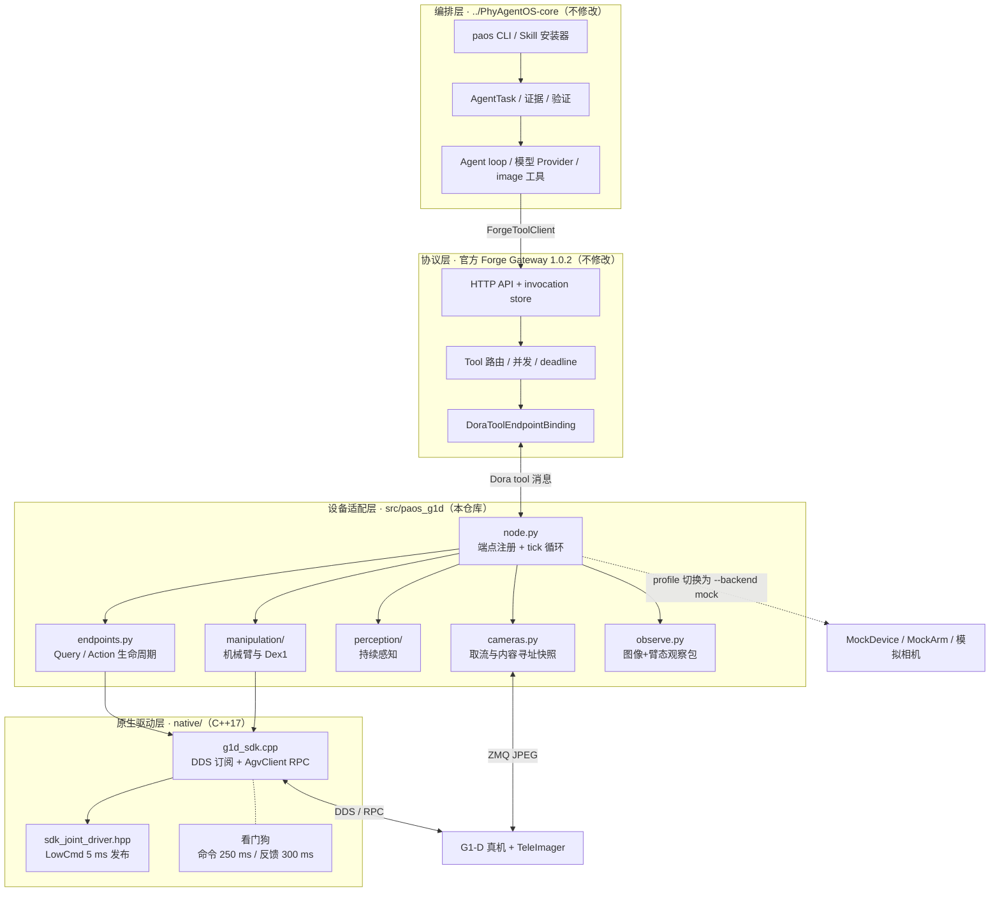
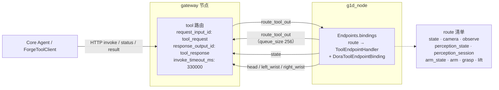
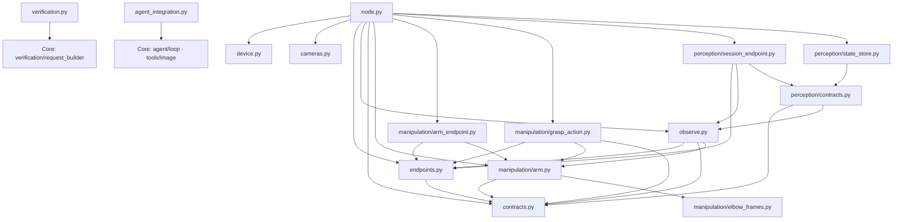
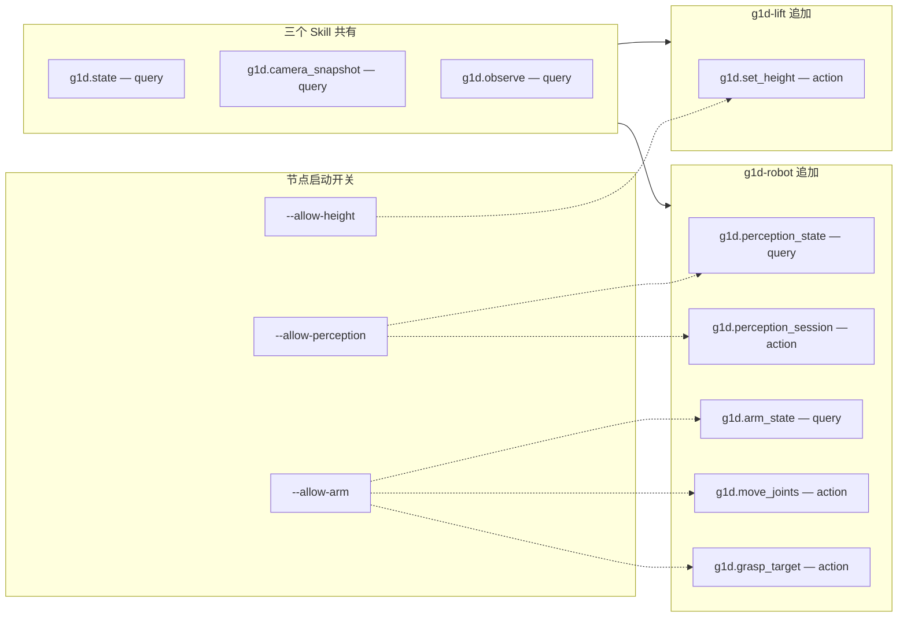
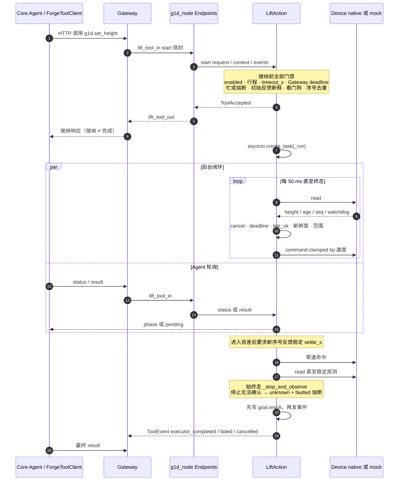
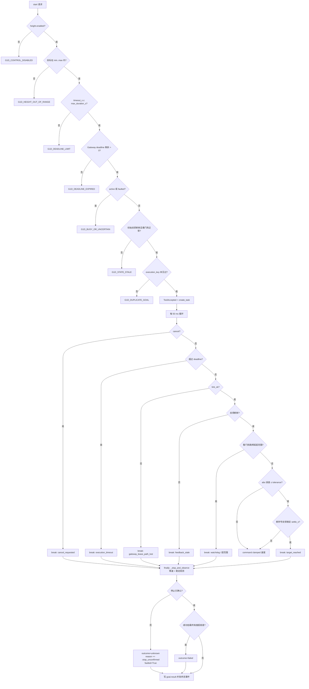
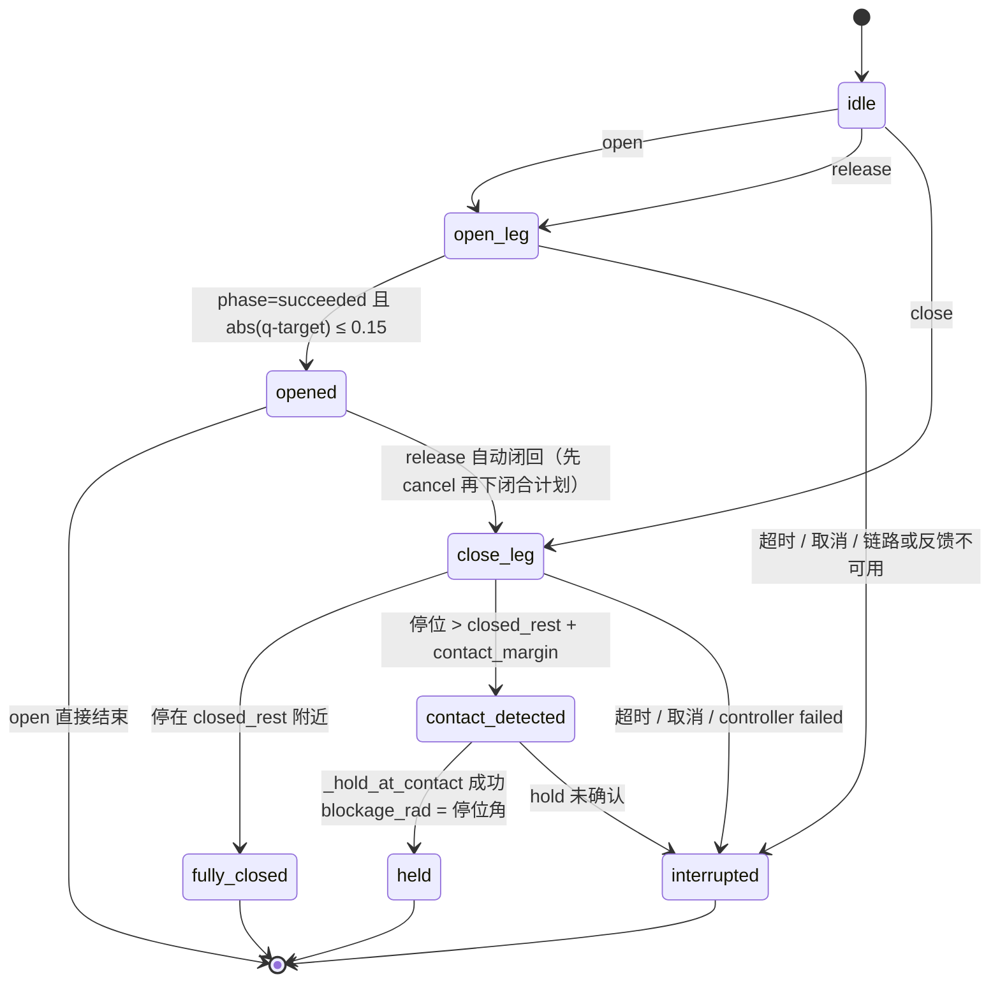
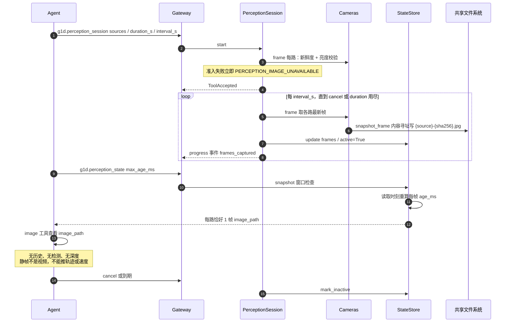
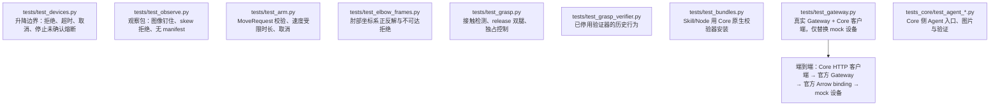

# G1-D 接入代码框架

本文用 Mermaid 描述 `PhyAgentOS-g1d` 的分层、路由、模块依赖、端点生命周期与构建流程。
图依据当前源码绘制（`src/paos_g1d`、`native`、`skills`、`scripts/build.py`）。

## 1. 分层总览

## 2. Dora 数据流与 Tool 路由

`scripts/build.py` 的 `dataflow()` 为每个 profile 生成这张图。工具路由是**双向成对**的：
`g1d/<route>_tool_out → gateway/<route>_tool_in`，以及反向的
`gateway/<route>_tool_out → g1d/<route>_tool_in`。

> 队列必须显式设为 256 条：接纳、状态、结果与注册消息共用同一路输入，Dora 默认的
> “只保留最新值”会吞掉 Action 接纳响应，导致紧随其后的状态轮询超时。

## 3. Python 模块依赖

`contracts.py` 是全项目的契约真源：`TOOLS` / `ARM_TOOLS` / `GRASP_TOOLS` /
`OBSERVE_TOOLS` / `PERCEPTION_TOOLS` 这些字典被 `scripts/build.py` 直接导入，
用于生成 Gateway 的 ToolSpec 与 JSON Schema。

## 4. 工具与 Skill 能力矩阵

只有声明了对应路由的 profile 才会注册并发布该端点；`g1d-robot` 不启用升降，
所以它的 real dataflow 只带 `--allow-arm --allow-perception`。

## 5. Action 生命周期时序（以 `g1d.set_height` 为例）

`JointAction`、`GraspAction`、`PerceptionSession` 都**只继承 `LiftAction` 的
`status/result/cancel`（以及 `_Goal`）**，物理行为各自实现。

## 6. 升降闭环控制流程

## 7. Dex1 夹爪状态机

闭合判定细节：稳定 0.4 s 且 `reference - q ≤ 0.18` 才算停位；停位高于
`closed_rest + contact_margin_rad` 判 `contact_detected`，否则 `fully_closed`。
`release` 的 `timeout_s` 必须同时覆盖开爪腿与闭回腿，否则接纳阶段就报
`GRASP_DEADLINE`。`open` / `close` / `release` 与 `move_joints` 共享同一把
`joints.lock` 与 `reservation`，全机同时只有一个控制者。

## 8. 持续感知时序

Gateway 1.0.2 不支持 session 语义，所以持续感知以**限时 Action + 独立 Query**
组合实现：Action 只抓帧落盘，Query 读最新状态，判断全部由 Agent 的视觉模型完成。

`StateStore` 只保留每路最新 1 帧，且**每次读取都按当前时刻重算 `age_ms`**，
不会把捕获时的年龄冻结下来。

## 9. 构建与打包流水线

```mermaid
flowchart LR
    PREP["scripts/prepare_dependency.py"] --> DEPS[".deps/forge-gateway/src<br/>forge_tool · forge_gateway"]
    CFG["configs/device.yaml<br/>configs/network.yaml<br/>configs/cameras.yaml"] --> BUILD["scripts/build.py"]
    DEPS --> BUILD

    BUILD --> GUARD{"Linux x86_64?<br/>network_interface 与 network.yaml 一致?"}
    GUARD --> CM["cmake -S native -B build/native"]
    CM --> SO["build/native/libg1d_sdk.so"]
    SO --> PYI["PyInstaller scripts/node_entry.py"]
    PYI --> BIN["build/bin/g1d_node"]
    BIN --> ARC["archive_node<br/>gzip mtime=0 可复现"]
    ARC --> NODEART["dist/nodes/g1d-node-0.1.0-linux-x86_64.tar.gz"]
    NODEART --> LOCK["真实 sha256 → artifacts.nodes.g1d 锁"]

    BUILD --> GWCFG["gateway_config()<br/>从 Pydantic 模型导出 JSON Schema<br/>+ 按 profile 裁剪 route"]
    GWCFG --> VALID["GatewayConfig.from_dict 校验"]
    LOCK --> PROF
    VALID --> PROF["profiles/mock|real/<br/>gateway.yaml · dataflow.yaml · device.yaml"]

    BUILD --> ASSETS["拷贝 cameras.yaml / 三个 .so<br/>收集 license 与第三方声明"]
    ASSETS --> MAN["生成 skill.yaml<br/>load_manifest 校验"]
    PROF --> MAN
    MAN --> PKG["Core scripts/package_skill.py"]
    PKG --> DIST["dist/skills/g1d-observe|lift|robot-*.tar.gz<br/>dist/build-report.json"]
```

## 10. 分层测试

`tests/test_gateway.py` 是唯一贯穿全链路的一层：它不替换 Gateway，也不替换
`forge_tool` 绑定，只把设备换成 `MockDevice`/模拟相机。

## 11. 关键安全约定

| 约定 | 落点 |
|---|---|
| 严格 Schema，多余字段直接拒绝 | `contracts.StrictModel` |
| 启用运动必须显式确认机械行程 | `HeightSettings.check_limits` / `Dex1Settings.check_travel` |
| 应用包络是“调试确认值”，不是厂商极限 | `arm.LIMITS`、`native/joint_motion.hpp::allowed` |
| 真机启动即收缩 Dex1 包络 | `arm.configure_limits`（mock 保持默认） |
| 任何 Action 都遵守 Gateway 绝对 deadline | `endpoints.LiftAction.start`、`arm_endpoint`、`grasp_action` |
| 收取消后不再发新的非零命令 | `endpoints._run` 循环内二次检查 |
| 所有终态都请求零速并观测停止 | `endpoints._stop_and_observe` |
| 停止无法确认 → `unknown` + 熔断，拒绝再接纳 | `LiftAction.faulted` |
| Gateway 注册确认 > 2 s 未到 → 本地取消 | `node.tick` 的 `link_ok` |
| 命令中断 250 ms / 反馈中断 300 ms → C++ 看门狗零速 | `native/g1d_sdk.cpp` 看门狗线程 |
| 关节写入永不持有反馈互斥锁 | `native/sdk_joint_driver.hpp` |
| 关节控制互斥由文件锁 + `/proc` 扫描保证 | `flock /tmp/paos-g1d-arm.lock` |
| 快照内容寻址且不可变 | `cameras.snapshot_frame` |
| DDS 断流不重复发布旧状态伪造新鲜度 | `node.tick` 序号变化判定 |
